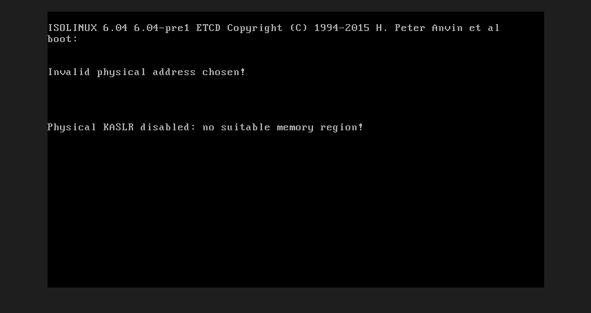
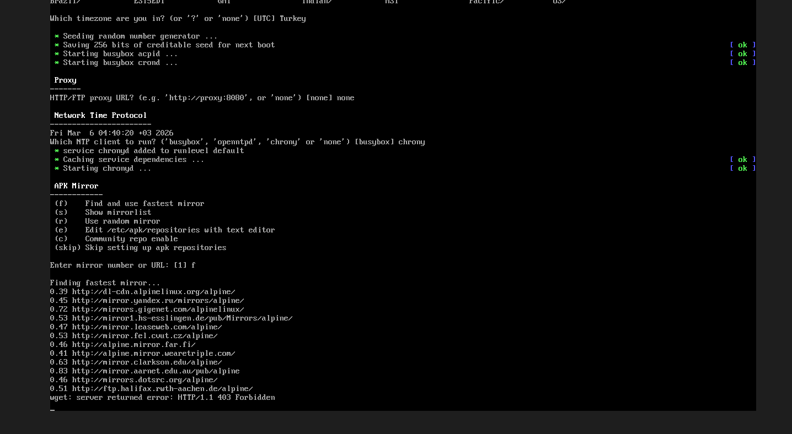
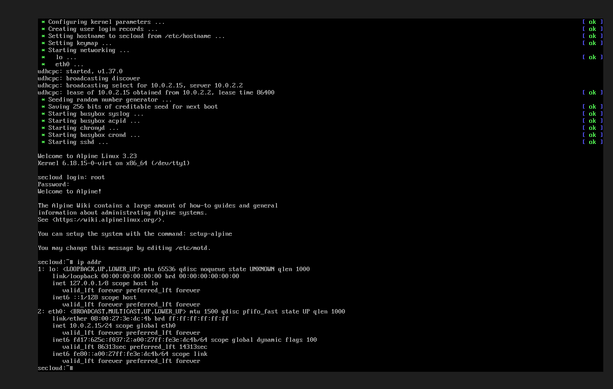

# SeCloud: Hardened Alpine Private Cloud 🌩️

  
  
  

---

## 🇬🇧 English

### 📝 Overview
**SeCloud** is a minimalist, highly secure, zero-trust private cloud environment built from scratch on Alpine Linux. The primary objective of this project is to provision a lightweight server footprint while enforcing strict security protocols, including disabling password-based authentication, configuring localized privilege escalation, and establishing a default-drop firewall policy.

### 🛠️ System Architecture & Tech Stack
* **Base OS:** Alpine Linux (Optimized for minimal resource consumption).
* **Access Management:** OpenSSH with strictly ED25519 Key-Based Authentication.
* **Privilege Escalation:** `doas` configured for the `wheel` group (replacing `sudo` for a smaller attack surface).
* **Network Security:** `iptables` enforcing a Default DROP policy for unhandled incoming traffic.
* **Monitoring:** `fastfetch` and `htop` for real-time resource tracking.

### 📓 Build Log & Troubleshooting
The deployment required overcoming several environment-specific challenges:

1. **Boot & Memory Allocation:**
   Resolved initial kernel panic and `Invalid physical address chosen!` errors by optimizing VM memory configurations and boot parameters.
    

2. **Network Interface & Package Mirroring:**
   Initial attempts to fetch packages resulted in `bad address` and `HTTP 403 Forbidden` errors due to DNS/routing issues. Resolved by reconfiguring the NIC to `Intel PRO/1000 MT Desktop` under NAT, allowing the `udhcpc` daemon to obtain a valid DHCP lease (`10.0.2.15`).
    
    

### 🛡️ System Hardening Implementation
Security was implemented at the core level during and after installation:

1. **Root Access Restriction:** Root password login was explicitly prohibited during the `setup-alpine` phase to prevent basic vector attacks.
    ![Init
